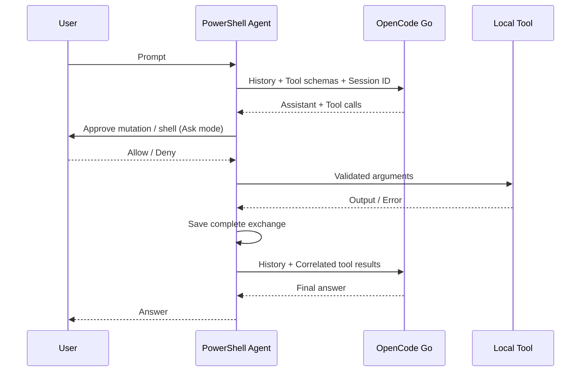

# 設計と参考コード

確認した参照コミット：

- PSAI: `018a3304dc7d09ac90e78525f5181bee17edb5a1`
- pi-mono: `1cedd32724abfcb0915f76cc61b6827e2c16dbad`

| 参考コード | 本実装で採用した設計 |
| --- | --- |
| PSAI `Public/New-Agent.ps1`, `Get-AgentResponse.ps1` | agent オブジェクトを生成し、依頼から最終回答までツールを繰り返す |
| PSAI `Public/Register-Tool.ps1` | モデルに JSON Schema のツール宣言を送る。今回は標準ツールに限定 |
| Pi `packages/agent/src/agent-loop.ts` | assistant → tool result → assistant を繰り返す。複数ツールにそれぞれ結果を返す |
| Pi `packages/coding-agent/src/core/tools/{read,write,edit,bash}.ts` | 読取・書込・正確な置換・shell を基本ツールとして持つ。shell は PowerShell に変更 |
| Pi `packages/ai/src/providers/opencode-go.ts` | Chat / Messages / Responses を分けて処理する |
| Pi `packages/ai/src/providers/opencode-headers.ts` | 固定の `x-opencode-session` を全 API リクエストへ付ける |

履歴は `user`、`assistant`、`result` の3種類で保存し、送信直前に provider の形式へ変換します。assistant の元応答も保存するため、reasoning / thinking / signature / Responses output item を次のリクエストで保持します。Responses は `store=false` と全履歴送信を使い、provider 側の状態保存に依存しません。

セッションの保存先は一時ファイルへ書込後に同じディレクトリ内で置換します。HTTP 失敗や不完全な応答では未完了の履歴を取り除き、完了したツール往復は残します。ファイル変更そのものは元に戻しません。同一 agent の同時実行は拒否します。

PowerShell 以外の言語ランタイムや SDK を依存に追加せず、HTTP は `Invoke-RestMethod`、プロセス・ファイル処理は標準 .NET API を利用しています。上流のソースファイルをコピーせずに実装しました。
