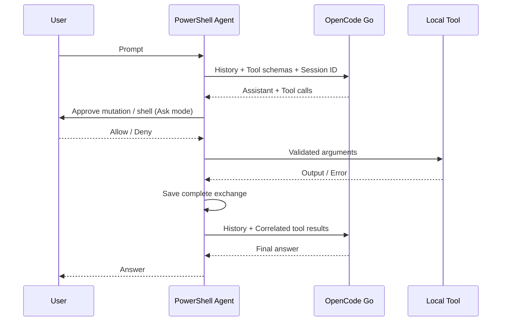

# 設計と参考コード

確認した参照コミット：

- PSAI: `018a3304dc7d09ac90e78525f5181bee17edb5a1`
- pi-mono: `1cedd32724abfcb0915f76cc61b6827e2c16dbad`

| 参考コード | 本実装で採用した設計 |
| --- | --- |
| PSAI `Public/New-Agent.ps1`, `Get-AgentResponse.ps1` | agent オブジェクトを生成し、依頼から最終回答までツールを繰り返す |
| PSAI `Public/Register-Tool.ps1` | モデルに JSON Schema のツール宣言を送る。今回は標準ツールに限定 |
| Pi `packages/agent/src/agent-loop.ts` | assistant → tool result → assistant を繰り返す。複数ツールにそれぞれ結果を返す |
| Pi `packages/coding-agent/src/core/tools/{read,write,edit,edit-diff,powershell,grep,find,ls,truncate,file-mutation-queue}.ts` | 7ツールの引数・出力・複数編集・除外検索・画像・出力制限・変更の直列化を PowerShell で実装 |
| Pi `packages/ai/src/providers/opencode-go.ts` | Chat / Messages / Responses を分けて処理する |
| Pi `packages/ai/src/providers/opencode-headers.ts` | 固定の `x-opencode-session` を全 API リクエストへ付ける |

履歴は `user`、`assistant`、`result` の3種類で保存し、送信直前に provider の形式へ変換します。assistant の元応答も保存するため、reasoning / thinking / signature / Responses output item を次のリクエストで保持します。Responses は `store=false` と全履歴送信を使い、provider 側の状態保存に依存しません。

セッションの保存先は一時ファイルへ書込後に同じディレクトリ内で置換します。HTTP 失敗や不完全な応答では未完了の履歴を取り除き、完了したツール往復は残します。ファイル変更そのものは元に戻しません。同一 agent の同時実行は拒否します。

PowerShell 以外の言語ランタイムや SDK を依存に追加せず、HTTP は `Invoke-RestMethod`、プロセス・ファイル処理は標準 .NET API を利用しています。上流のソースファイルをコピーせずに実装しました。

ツールの実装は `Tools.ps1` に分離しています。JSON Schema と同じ型・必須引数・範囲を再帰的に検証します。モデルに見せる `Get-GoTools -Agent $agent` は読取専用モードでは変更ツールを除外し、実行側でも禁止を確認します。旧 `list`／`shell` 名は保存済み会話用の実行時エイリアスとして残しています。

編集は LF に正規化した元ファイルで照合します。補助照合が必要な場合は、NFKC・末尾空白・引用符・ダッシュなどを正規化した空間で範囲を計算し、触れた行だけを元ファイルへ戻します。全置換の一意性と重複を検証後、逆順に適用します。差分は変更ブロックに対する上限付き LCS で計算し、大きいブロックは有効な全ブロック置換パッチに切り替えます。変更を名前付き mutex で直列化し、同じディレクトリに作成した一時ファイルから置換します。

コマンドの stdout／stderr は非同期にファイルへ転送し、大量出力を丸ごとメモリに保持しません。末尾だけを UTF-8 の境界で読取り、2000行／50 KiB 制限を適用します。出力更新は小さなチャンクで呼出元へ渡します。PowerShell のストリームは子プロセス内でまとめ、ランタイムから直接 stderr に出た内容は末尾へ追加します。

画像ブロックは履歴に保持します。Messages は `tool_result.content` 内へ、Chat と Responses はすべてのツール結果を送信した後に関連する user 画像メッセージとして変換します。画像送信を無効にしたときはバイナリ添付を省略し、説明だけを送ります。
