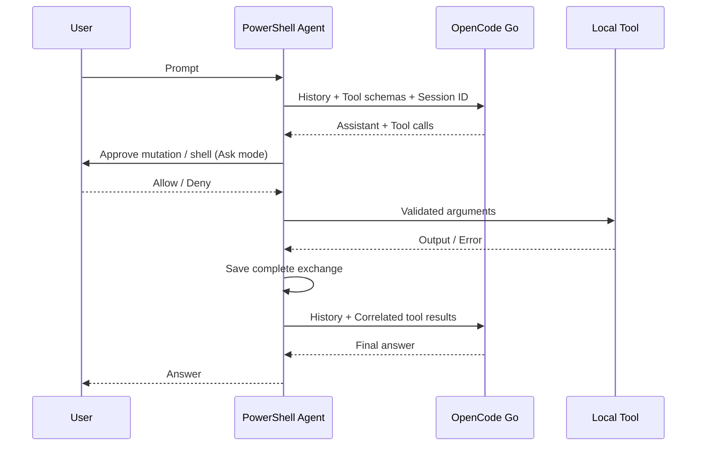

# Design and reference code

Reference commits reviewed:

- PSAI: `018a3304dc7d09ac90e78525f5181bee17edb5a1`
- pi-mono: `1cedd32724abfcb0915f76cc61b6827e2c16dbad`

| Reference | Design adopted |
| --- | --- |
| PSAI `Public/New-Agent.ps1`, `Get-AgentResponse.ps1` | Agent objects and repeated tool execution until the final answer |
| PSAI `Public/Register-Tool.ps1` | JSON Schema tool declarations; restricted here to built-in tools |
| Pi `packages/agent/src/agent-loop.ts` | Assistant/tool-result/assistant loop with correlated results for every call |
| Pi `packages/coding-agent/src/core/tools/{read,write,edit,edit-diff,powershell,grep,find,ls,truncate,file-mutation-queue}.ts` | Seven tools, batch editing, exclusions, images, truncation, and serialized mutations |
| Pi `packages/ai/src/providers/opencode-go.ts` | Separate Chat, Messages, and Responses handling |
| Pi `packages/ai/src/providers/opencode-headers.ts` | Stable `x-opencode-session` on every API request |

History contains `user`, `assistant`, and `result` records, converted to provider format before sending. Original assistant responses retain reasoning, thinking, signatures, and Responses output items for replay. Responses uses `store=false` and complete history rather than relying on provider-side state. Model changes reconstruct assistant records from canonical text and calls, dropping foreign reasoning metadata.

Sessions are written to a temporary file and replaced in the same directory. Failed/incomplete responses roll back unfinished history while retaining completed tool exchanges and file changes. Concurrent turns on the same agent are rejected.

The implementation uses standard PowerShell/.NET HTTP, process, and file APIs without additional runtimes or SDKs. Upstream source files were not copied.

`Tools.ps1` validates types, required arguments, and ranges recursively against JSON Schema. Read-only mode omits mutation tools and rejects them during execution. Legacy `list`/`shell` aliases remain for saved conversations.

Edits match the LF-normalized original file. Fallback matching normalizes NFKC, trailing whitespace, quotes, and dashes, then maps touched lines back to the original content. All replacements are validated for uniqueness and overlap before reverse-order application. Bounded LCS generates diffs; large blocks use valid whole-block replacement patches. Named mutexes serialize mutations; installation uses same-directory temporary files.

Command stdout/stderr is spooled asynchronously to disk. Incremental UTF-8 decoders preserve split multibyte characters. Results retain only a bounded tail; update callbacks receive small chunks. Child PowerShell streams are merged, with direct runtime stderr appended afterward.

Image blocks remain in history. Messages places them in `tool_result.content`; Chat/Responses adds associated user image messages after tool results. Disabled images omit binary attachments and send explanatory text.

`Streaming.ps1` uses HttpClient with ResponseHeadersRead and processes SSE data fields per event. Chat accumulates choice/tool-index deltas; Messages accumulates content, signature, and input-JSON blocks. Responses notifies deltas and saves canonical output from `response.completed`. Tools execute only after completion and validation.

`Console.ps1` implements the inline editor, selectors, and renderer. Renderer closures bind helper scriptblocks explicitly so API module callbacks can access helpers defined in the CLI's child script scope. Reasoning expansion changes presentation without altering saved API history. The CLI displays events and does not duplicate the final return value.
